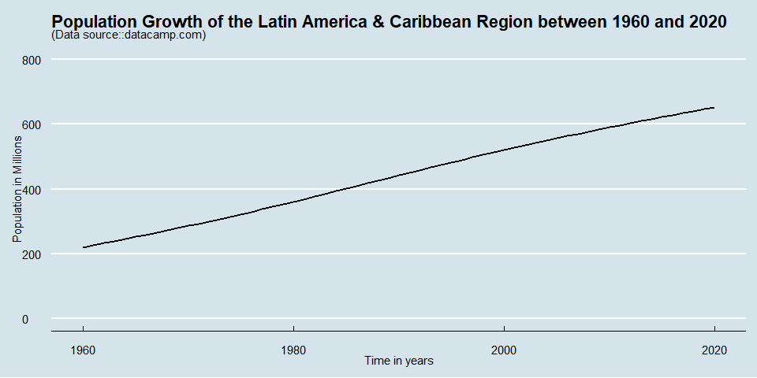
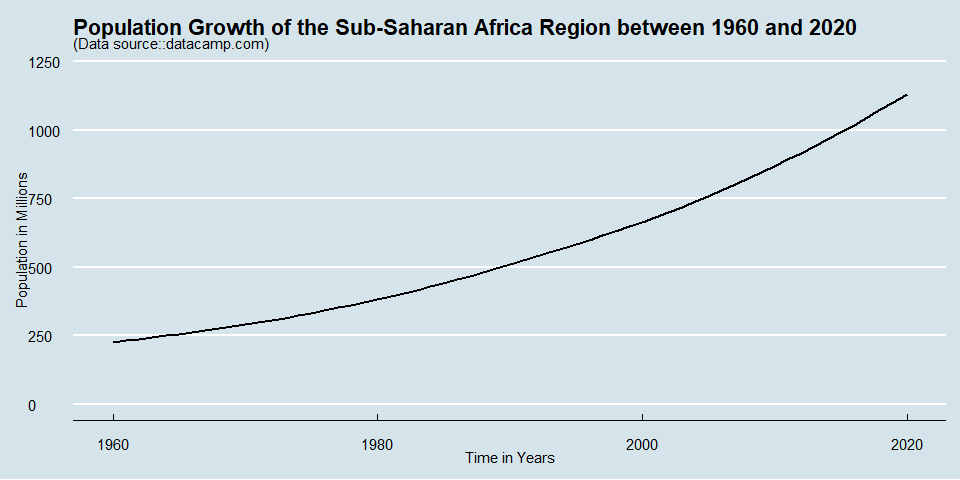

Analyzing World Population Data
================
Mwangi George
2022-10-22

-   <a href="#loading-datasets" id="toc-loading-datasets">Loading
    datasets</a>
-   <a href="#wrangling-the-data" id="toc-wrangling-the-data">Wrangling the
    data</a>
-   <a href="#analysis" id="toc-analysis">Analysis</a>
    -   <a href="#how-did-the-population-of-kenya-change-over-time"
        id="toc-how-did-the-population-of-kenya-change-over-time">How did the
        population of Kenya change over time?</a>
    -   <a
        href="#how-did-the-population-in-different-regions-of-the-world-change-over-time"
        id="toc-how-did-the-population-in-different-regions-of-the-world-change-over-time">How
        did the population in different regions of the world change over
        time?</a>

``` r
# load important packages
# tidyverse for data importation, wrangling and visualization
# janitor for data cleaning 
# lubridate for dealing with dates and 
# ggthemes for plotting themes
pacman::p_load(tidyverse, janitor, lubridate, ggthemes)
```

## Loading datasets

We will be working with two data sets, one that contains the population
figures for all countries, and another one that contains additional
information about each country such as income group, region, and special
notes. These data sets can be download
[here](https://www.datacamp.com/workspace/datasets/dataset-r-world-population).

``` r
# load data files
country_info <- read_csv("datasets/country_info.csv", 
                         show_col_types = F) %>% 
                            # clean variable names 
                            clean_names()

pop_data <- read_csv("datasets/pop_data.csv",
                     show_col_types = F)
```

## Wrangling the data

It is critical that we comprehend the structure, data types, and shape
of the data we’ll be working with. We will execute some code in this
part to aid in our data exploration.

``` r
# print the structure of pop_data
glimpse(pop_data)
```

    ## Rows: 266
    ## Columns: 64
    ## $ `Country Code`   <chr> "ABW", "AFE", "AFG", "AFW", "AGO", "ALB", "AND", "ARB…
    ## $ `Indicator Name` <chr> "\"Population, total\"", "\"Population, total\"", "\"…
    ## $ `Indicator Code` <chr> "SP.POP.TOTL", "SP.POP.TOTL", "SP.POP.TOTL", "SP.POP.…
    ## $ `1960`           <dbl> 54208, 130836765, 8996967, 96396419, 5454938, 1608800…
    ## $ `1961`           <dbl> 55434, 134159786, 9169406, 98407221, 5531451, 1659800…
    ## $ `1962`           <dbl> 56234, 137614644, 9351442, 100506960, 5608499, 171131…
    ## $ `1963`           <dbl> 56699, 141202036, 9543200, 102691339, 5679409, 176262…
    ## $ `1964`           <dbl> 57029, 144920186, 9744772, 104953470, 5734995, 181413…
    ## $ `1965`           <dbl> 57357, 148769974, 9956318, 107289875, 5770573, 186479…
    ## $ `1966`           <dbl> 57702, 152752671, 10174840, 109701811, 5781305, 19145…
    ## $ `1967`           <dbl> 58044, 156876454, 10399936, 112195950, 5774440, 19655…
    ## $ `1968`           <dbl> 58377, 161156430, 10637064, 114781116, 5771973, 20222…
    ## $ `1969`           <dbl> 58734, 165611760, 10893772, 117468741, 5803677, 20816…
    ## $ `1970`           <dbl> 59070, 170257189, 11173654, 120269044, 5890360, 21354…
    ## $ `1971`           <dbl> 59442, 175100167, 11475450, 123184308, 6041239, 21878…
    ## $ `1972`           <dbl> 59849, 180141148, 11791222, 126218502, 6248965, 22431…
    ## $ `1973`           <dbl> 60236, 185376550, 12108963, 129384954, 6497283, 22967…
    ## $ `1974`           <dbl> 60527, 190800796, 12412960, 132699537, 6761623, 23501…
    ## $ `1975`           <dbl> 60653, 196409937, 12689164, 136173544, 7023994, 24048…
    ## $ `1976`           <dbl> 60586, 202205766, 12943093, 139813171, 7279630, 24585…
    ## $ `1977`           <dbl> 60366, 208193045, 13171294, 143615715, 7533814, 25135…
    ## $ `1978`           <dbl> 60102, 214368393, 13341199, 147571063, 7790774, 25662…
    ## $ `1979`           <dbl> 59972, 220740384, 13411060, 151663853, 8058112, 26178…
    ## $ `1980`           <dbl> 60097, 227305945, 13356500, 155882270, 8341290, 26719…
    ## $ `1981`           <dbl> 60561, 234058404, 13171679, 160223588, 8640478, 27260…
    ## $ `1982`           <dbl> 61341, 240999134, 12882518, 164689764, 8952971, 27842…
    ## $ `1983`           <dbl> 62213, 248146290, 12537732, 169279422, 9278104, 28439…
    ## $ `1984`           <dbl> 62826, 255530063, 12204306, 173991851, 9614756, 29044…
    ## $ `1985`           <dbl> 63024, 263161451, 11938204, 178826553, 9961993, 29647…
    ## $ `1986`           <dbl> 62645, 271050065, 11736177, 183785612, 10320116, 3022…
    ## $ `1987`           <dbl> 61838, 279184536, 11604538, 188868567, 10689247, 3083…
    ## $ `1988`           <dbl> 61072, 287524258, 11618008, 194070079, 11068051, 3142…
    ## $ `1989`           <dbl> 61033, 296024639, 11868873, 199382783, 11454784, 3227…
    ## $ `1990`           <dbl> 62152, 304648010, 12412311, 204803865, 11848385, 3286…
    ## $ `1991`           <dbl> 64623, 313394693, 13299016, 210332267, 12248901, 3266…
    ## $ `1992`           <dbl> 68240, 322270073, 14485543, 215976366, 12657361, 3247…
    ## $ `1993`           <dbl> 72495, 331265579, 15816601, 221754806, 13075044, 3227…
    ## $ `1994`           <dbl> 76705, 340379934, 17075728, 227692136, 13503753, 3207…
    ## $ `1995`           <dbl> 80324, 349605660, 18110662, 233807627, 13945205, 3187…
    ## $ `1996`           <dbl> 83211, 358953595, 18853444, 240114179, 14400722, 3168…
    ## $ `1997`           <dbl> 85450, 368440591, 19357126, 246613750, 14871572, 3148…
    ## $ `1998`           <dbl> 87280, 378098393, 19737770, 253302310, 15359600, 3128…
    ## $ `1999`           <dbl> 89009, 387977990, 20170847, 260170348, 15866871, 3108…
    ## $ `2000`           <dbl> 90866, 398113044, 20779957, 267214544, 16395477, 3089…
    ## $ `2001`           <dbl> 92892, 408522129, 21606992, 274433894, 16945753, 3060…
    ## $ `2002`           <dbl> 94992, 419223717, 22600774, 281842480, 17519418, 3051…
    ## $ `2003`           <dbl> 97016, 430246635, 23680871, 289469530, 18121477, 3039…
    ## $ `2004`           <dbl> 98744, 441630149, 24726689, 297353098, 18758138, 3026…
    ## $ `2005`           <dbl> 100028, 453404076, 25654274, 305520588, 19433604, 301…
    ## $ `2006`           <dbl> 100830, 465581372, 26433058, 313985474, 20149905, 299…
    ## $ `2007`           <dbl> 101226, 478166911, 27100542, 322741656, 20905360, 297…
    ## $ `2008`           <dbl> 101362, 491173160, 27722281, 331772330, 21695636, 294…
    ## $ `2009`           <dbl> 101452, 504604672, 28394806, 341050537, 22514275, 292…
    ## $ `2010`           <dbl> 101665, 518468229, 29185511, 350556886, 23356247, 291…
    ## $ `2011`           <dbl> 102050, 532760424, 30117411, 360285439, 24220660, 290…
    ## $ `2012`           <dbl> 102565, 547482863, 31161378, 370243017, 25107925, 290…
    ## $ `2013`           <dbl> 103165, 562601578, 32269592, 380437896, 26015786, 289…
    ## $ `2014`           <dbl> 103776, 578075373, 33370804, 390882979, 26941773, 288…
    ## $ `2015`           <dbl> 104339, 593871847, 34413603, 401586651, 27884380, 288…
    ## $ `2016`           <dbl> 104865, 609978946, 35383028, 412551299, 28842482, 287…
    ## $ `2017`           <dbl> 105361, 626392880, 36296111, 423769930, 29816769, 287…
    ## $ `2018`           <dbl> 105846, 643090131, 37171922, 435229381, 30809787, 286…
    ## $ `2019`           <dbl> 106310, 660046272, 38041757, 446911598, 31825299, 285…
    ## $ `2020`           <dbl> 106766, 677243299, 38928341, 458803476, 32866268, 283…

From the above output, we make some important insights about our data:

-   The data contains 266 rows and 64 columns. Each country has a single
    row with multiple columns to hold the population figures of various
    years; also called the wide data format.

-   We definitely want to change the naming of the variables to remove
    the backticks.

-   Additionally, we will transform the data into the long format,
    remove unnecessary columns, check whether there are NA’s.

``` r
# remove unnecessary columns
pop_data <- pop_data %>% 
  select(-c("Indicator Name", "Indicator Code"))

# transform to long format
pop_data <- pop_data %>%
  # change to the long format
  pivot_longer(
    # choose the columns to transform
    cols = -c("Country Code"),
    names_to = "year", 
    values_to = "population") %>% 
  # rename country code column
  rename("country_code" = "Country Code")

# print the first 3 rows 
pop_data %>% 
  slice_head(n = 3)
```

    ## # A tibble: 3 × 3
    ##   country_code year  population
    ##   <chr>        <chr>      <dbl>
    ## 1 ABW          1960       54208
    ## 2 ABW          1961       55434
    ## 3 ABW          1962       56234

``` r
# check for rows with incomplete cases
pop_data %>% 
  filter(!complete.cases(.))
```

    ## # A tibble: 103 × 3
    ##    country_code year  population
    ##    <chr>        <chr>      <dbl>
    ##  1 ERI          2012          NA
    ##  2 ERI          2013          NA
    ##  3 ERI          2014          NA
    ##  4 ERI          2015          NA
    ##  5 ERI          2016          NA
    ##  6 ERI          2017          NA
    ##  7 ERI          2018          NA
    ##  8 ERI          2019          NA
    ##  9 ERI          2020          NA
    ## 10 INX          1960          NA
    ## # … with 93 more rows

There exists records with incomplete data, however, based on the
questions we hope to
answer([README](https://github.com/mwangi-george/Analyzing-World-Population-Data/tree/main)),
these missing values might not affect our analysis, therefore, no reason
to remove them.

Let’s now shift our focus to the other table, `country_info`.

``` r
glimpse(country_info)
```

    ## Rows: 265
    ## Columns: 5
    ## $ country_code  <chr> "ABW", "AFE", "AFG", "AFW", "AGO", "ALB", "AND", "ARB", …
    ## $ region        <chr> "Latin America & Caribbean", "null", "South Asia", "null…
    ## $ income_group  <chr> "High income", "null", "Low income", "null", "Lower midd…
    ## $ special_notes <chr> "null", "\"26 countries, stretching from the Red Sea in …
    ## $ table_name    <chr> "Aruba", "Africa Eastern and Southern", "Afghanistan", "…

We can make some important observations from the code output above:

-   Unlike the pop_data table which contained 266 rows, country_info
    contains 265 rows, indicating that there exists a record in one
    table and not in the other table.

-   Some observations are coded as `null` instead of `NA`.

-   Also, we will rename the `table_name` column to `country_name`.

Let’s start by identifying the records in the pop_data table that are
not in the country_info table.

``` r
not_in_pop_data <- pop_data %>% 
  # view rows not in country_info table 
  anti_join(country_info, by = "country_code")

unique(not_in_pop_data$country_code)
```

    ## [1] "INX"

``` r
unique(not_in_pop_data$population)
```

    ## [1] NA

We discover that the demographic data for a nation with the code `INX`
is missing for all years. As a result, we can take it off the table.

``` r
pop_data <- pop_data %>% 
  # filter INX
  filter(country_code != "INX")
```

We also need to change nulls to NA’s in the table country_info.

``` r
# replace nulls with NA in the whole data frame
country_info <- data.frame(lapply(country_info,
                                  function(x)
                                    {
                                    gsub(x,
                                         pattern = "null",
                                         replacement = NA)
                                    }
                                  )
                           ) 


head(country_info)
```

    ##   country_code                    region        income_group
    ## 1          ABW Latin America & Caribbean         High income
    ## 2          AFE                      <NA>                <NA>
    ## 3          AFG                South Asia          Low income
    ## 4          AFW                      <NA>                <NA>
    ## 5          AGO        Sub-Saharan Africa Lower middle income
    ## 6          ALB     Europe & Central Asia Upper middle income
    ##                                                                                                                                                                                                                           special_notes
    ## 1                                                                                                                                                                                                                                  <NA>
    ## 2                                                                  "26 countries, stretching from the Red Sea in the North to the Cape of Good Hope in the South (https://www.worldbank.org/en/region/afr/eastern-and-southern-africa)"
    ## 3                                                                                                                                                           Fiscal year end: March 20; reporting period for national accounts data: FY.
    ## 4 "22 countries, stretching from the westernmost point of Africa, across the equator, and partly along the Atlantic Ocean till the Republic of Congo in the South (https://www.worldbank.org/en/region/afr/western-and-central-africa)"
    ## 5                                                                                                                                                                                                                                  <NA>
    ## 6                                                                                                                                                                                                                                  <NA>
    ##                    table_name
    ## 1                       Aruba
    ## 2 Africa Eastern and Southern
    ## 3                 Afghanistan
    ## 4  Africa Western and Central
    ## 5                      Angola
    ## 6                     Albania

-   Renaming columns

``` r
# rename table_name column
country_info <- country_info %>% 
  rename("country_name" = "table_name")

# print column names
names(country_info)
```

    ## [1] "country_code"  "region"        "income_group"  "special_notes"
    ## [5] "country_name"

Last but not least, it would be a good idea to utilize a single data
frame for all of our analysis.

We’ll join the two tables together using the `country_code` column
before choosing our key variables.

``` r
world_pop <- pop_data %>%
  # join the two tables on key columns
  inner_join(country_info, 
             by = "country_code") %>% 
  # select variables of interest
  select(country_name, 
         region, 
         income_group, 
         year, 
         population)

# view a few rows
world_pop %>% 
  head(3)
```

    ## # A tibble: 3 × 5
    ##   country_name region                    income_group year  population
    ##   <chr>        <chr>                     <chr>        <chr>      <dbl>
    ## 1 Aruba        Latin America & Caribbean High income  1960       54208
    ## 2 Aruba        Latin America & Caribbean High income  1961       55434
    ## 3 Aruba        Latin America & Caribbean High income  1962       56234

``` r
# check for correct data types 
glimpse(world_pop)
```

    ## Rows: 16,165
    ## Columns: 5
    ## $ country_name <chr> "Aruba", "Aruba", "Aruba", "Aruba", "Aruba", "Aruba", "Ar…
    ## $ region       <chr> "Latin America & Caribbean", "Latin America & Caribbean",…
    ## $ income_group <chr> "High income", "High income", "High income", "High income…
    ## $ year         <chr> "1960", "1961", "1962", "1963", "1964", "1965", "1966", "…
    ## $ population   <dbl> 54208, 55434, 56234, 56699, 57029, 57357, 57702, 58044, 5…

Let’s change the variables `country_name`, `region`, `income_group` into
factors and `year` into numeric.

``` r
world_pop <- world_pop %>% 
  mutate(country_name = as.factor(country_name),
         region = as.factor(region),
         income_group = as.factor(income_group),
         year = as.numeric(year))
```

## Analysis

### How did the population of Kenya change over time?

We will make a graphic that plots population data on the y axis and time
on the x axis in order to provide an answer to this question. But first,
we must search for rows in our `world_pop` dataframe that include
information on Kenya. Take note of the code chunk below, where we use
pipe operators to construct data pipelines.

``` r
options(scipen = 999) # removes the scientific notation

world_pop %>% 
  # filter for rows with Kenya data
  filter(country_name == "Kenya") %>% 
  # manipulate variables of interest
  transmute(year, 
            population = population/1000000)%>%
  # create the plot's base layer
  ggplot(aes(year, population))+
  geom_line(size = 1)+
  theme_economist()+
  labs(title = "Population of Kenya between 1960 and 2020",
       y = "Population in Millions",
       x = "Time in Years",
       subtitle = "(Data source::datacamp.com)")
```

<!-- -->

``` r
# determine population growth rate
Kenya <- world_pop %>% 
  filter(country_name == "Kenya") %>% 
  transmute(year, 
            population, 
            population_lag = lag(population),
            growth_rate = (population - population_lag)/population*100)

head(Kenya)
```

    ## # A tibble: 6 × 4
    ##    year population population_lag growth_rate
    ##   <dbl>      <dbl>          <dbl>       <dbl>
    ## 1  1960    8120082             NA       NA   
    ## 2  1961    8377693        8120082        3.07
    ## 3  1962    8647002        8377693        3.11
    ## 4  1963    8928510        8647002        3.15
    ## 5  1964    9222692        8928510        3.19
    ## 6  1965    9530163        9222692        3.23

``` r
# calculate average population growth rate 
Kenya %>% 
  summarize(average_pop_growth_rate = mean(growth_rate, na.rm = T))
```

    ## # A tibble: 1 × 1
    ##   average_pop_growth_rate
    ##                     <dbl>
    ## 1                    3.10

It is evident from the graph above that Kenya’s population increased
quickly between 1960 and 2020. The population was about 8 million in
1960. Since then, this number has increased to over 50 million until the
year 2020. On average, the population grew by 3.100397 percent since
1960.

### How did the population in different regions of the world change over time?

Let’s start by identifying all the regions in the world_pop dataset.

``` r
# print unique regions in the world
unique(world_pop$region)
```

    ## [1] Latin America & Caribbean  <NA>                      
    ## [3] South Asia                 Sub-Saharan Africa        
    ## [5] Europe & Central Asia      Middle East & North Africa
    ## [7] East Asia & Pacific        North America             
    ## 7 Levels: East Asia & Pacific ... Sub-Saharan Africa

We identify 7 regions in the dataset. We are going to analyze each of
these regions individually and then compare the findings.

**Latin America & Caribbean Region**

``` r
# filter for observations where region is Latin America & Caribbean
Latin_America_Caribbean <- world_pop %>%
  filter(region == "Latin America & Caribbean")

# aggregate the population 
summarized_latin <- Latin_America_Caribbean %>%
  # select variables of interest
  transmute(year, 
            # transform population into millions
            population = population/1000000) %>% 
  group_by(year) %>% 
  # aggregate the population for all countries
  summarize(population =sum(population))
```

*To avoid repeating the above transformation steps for all the other
regions, we can create a function that will automate these steps. We can
do so as show in the code chunk below*

``` r
transform <- function(x)
{
  x %>% # where x is a dataframe
    filter(!is.na(population)) %>% # remove rows with NA's
    transmute(year,  # select variables of interest
              population = population/1000000) %>% # transform population into millions
    group_by(year) %>% # aggregate the population for all countries
    summarize(population =sum(population))
}
```

``` r
# print the first 6 rows of the aggregated data
head(summarized_latin)
```

    ## # A tibble: 6 × 2
    ##    year population
    ##   <dbl>      <dbl>
    ## 1  1960       220.
    ## 2  1961       226.
    ## 3  1962       232.
    ## 4  1963       239.
    ## 5  1964       245.
    ## 6  1965       252.

``` r
# print the first 6 rows of the aggregated data
tail(summarized_latin)
```

    ## # A tibble: 6 × 2
    ##    year population
    ##   <dbl>      <dbl>
    ## 1  2015       622.
    ## 2  2016       628.
    ## 3  2017       635.
    ## 4  2018       640.
    ## 5  2019       646.
    ## 6  2020       652.

``` r
# visualize the data
summarized_latin %>% 
  ggplot(aes(year, population))+
  geom_line(size = 1)+
  theme_economist()+
  labs(title = "Population Growth of the Latin America & Caribbean Region between 1960 and 2020",
       y = "Population in Millions",
       x = "Time in years",
       subtitle = "(Data source::datacamp.com)")
```

<!-- -->

``` r
# create population growth rate for each year 
summarized_latin <- summarized_latin %>% 
  mutate(population_lag = lag(population),
         growth_rate = (population- population_lag)/population*100)

#print summarized_latin
summarized_latin
```

    ## # A tibble: 61 × 4
    ##     year population population_lag growth_rate
    ##    <dbl>      <dbl>          <dbl>       <dbl>
    ##  1  1960       220.            NA        NA   
    ##  2  1961       226.           220.        2.69
    ##  3  1962       232.           226.        2.70
    ##  4  1963       239.           232.        2.69
    ##  5  1964       245.           239.        2.67
    ##  6  1965       252.           245.        2.63
    ##  7  1966       258.           252.        2.58
    ##  8  1967       265.           258.        2.54
    ##  9  1968       272.           265.        2.51
    ## 10  1969       279.           272.        2.47
    ## # … with 51 more rows

``` r
# calculate the average growth rate for all years
summarized_latin %>% 
summarize(mean_growth_rate = mean(growth_rate, na.rm= T))
```

    ## # A tibble: 1 × 1
    ##   mean_growth_rate
    ##              <dbl>
    ## 1             1.79

The population of the region of Latin America and the Caribbean has been
growing at a declining rate, according to the graph above. Since 1960,
this region’s average growth rate was 1.794714 percent.

**South Asia Region**

``` r
# filter for observations where region is South Asia
south_asia <- world_pop %>%
  filter(region == "South Asia")

# we can pass the filtered dataframe into our transform function to get the aggregated data
summarized_south_asia <- transform(south_asia)

# print the first 6 rows of the aggregated data
head(summarized_south_asia)
```

    ## # A tibble: 6 × 2
    ##    year population
    ##   <dbl>      <dbl>
    ## 1  1960       573.
    ## 2  1961       585.
    ## 3  1962       597.
    ## 4  1963       610.
    ## 5  1964       624.
    ## 6  1965       638.

``` r
# print the first 6 rows of the aggregated data
tail(summarized_south_asia)
```

    ## # A tibble: 6 × 2
    ##    year population
    ##   <dbl>      <dbl>
    ## 1  2015      1749.
    ## 2  2016      1771.
    ## 3  2017      1793.
    ## 4  2018      1814.
    ## 5  2019      1836.
    ## 6  2020      1857.

``` r
# visualize the data
summarized_south_asia %>% 
  ggplot(aes(year, population))+
  geom_line(size = 1)+
  ylim(500, 2000)+
  theme_economist()+
  labs(title = "Population Growth of the South Asia Region between 1960 and 2020",
       y = "Population in Millions",
       x = "Time in Years",
       subtitle = "(Data source::datacamp.com)")
```

<!-- -->

``` r
# create population growth rate column 
summarized_south_asia <- summarized_south_asia %>% 
  mutate(population_lag = lag(population),
         growth_rate = (population- population_lag)/population*100)

#print summarized_south_asia
summarized_south_asia
```

    ## # A tibble: 61 × 4
    ##     year population population_lag growth_rate
    ##    <dbl>      <dbl>          <dbl>       <dbl>
    ##  1  1960       573.            NA        NA   
    ##  2  1961       585.           573.        2.07
    ##  3  1962       597.           585.        2.10
    ##  4  1963       610.           597.        2.13
    ##  5  1964       624.           610.        2.15
    ##  6  1965       638.           624.        2.18
    ##  7  1966       652.           638.        2.20
    ##  8  1967       667.           652.        2.21
    ##  9  1968       682.           667.        2.23
    ## 10  1969       698.           682.        2.24
    ## # … with 51 more rows

``` r
# calculate the average growth rate for all years
summarized_south_asia %>% 
summarize(mean_growth_rate = mean(growth_rate, na.rm= T))
```

    ## # A tibble: 1 × 1
    ##   mean_growth_rate
    ##              <dbl>
    ## 1             1.94

The population of the region of South Asia has been growing at a
declining rate, according to the graph above. Since 1960, this region’s
average growth rate was 1.940208 percent.

**Sub-Saharan Africa Region**

``` r
# filter for observations where region is Sub-Saharan Africa
sub_saharan_africa <- world_pop %>%
  filter(region == "Sub-Saharan Africa")

# aggregate the population 
summarized_sub_saharan_africa <- transform(sub_saharan_africa)

# print the first 6 rows of the aggregated data
head(summarized_sub_saharan_africa)
```

    ## # A tibble: 6 × 2
    ##    year population
    ##   <dbl>      <dbl>
    ## 1  1960       227.
    ## 2  1961       233.
    ## 3  1962       238.
    ## 4  1963       244.
    ## 5  1964       250.
    ## 6  1965       256.

``` r
# print the first 6 rows of the aggregated data
tail(summarized_sub_saharan_africa)
```

    ## # A tibble: 6 × 2
    ##    year population
    ##   <dbl>      <dbl>
    ## 1  2015       992.
    ## 2  2016      1019.
    ## 3  2017      1047.
    ## 4  2018      1075.
    ## 5  2019      1103.
    ## 6  2020      1133.

``` r
# visualize the data
summarized_sub_saharan_africa %>% 
  ggplot(aes(year, population))+
  geom_line(size = 1)+
  theme_economist()+
  labs(title = "Population Growth of the Sub-Saharan Africa Region between 1960 and 2020",
       y = "Population in Millions",
       x = "Time in Years",
       subtitle = "(Data source::datacamp.com)")
```

<!-- -->

``` r
# create population growth rate column 
summarized_sub_saharan_africa <- summarized_sub_saharan_africa %>% 
  mutate(population_lag = lag(population),
         growth_rate = (population- population_lag)/population*100)

#print summarized_south_asia
summarized_sub_saharan_africa
```

    ## # A tibble: 61 × 4
    ##     year population population_lag growth_rate
    ##    <dbl>      <dbl>          <dbl>       <dbl>
    ##  1  1960       227.            NA        NA   
    ##  2  1961       233.           227.        2.29
    ##  3  1962       238.           233.        2.33
    ##  4  1963       244.           238.        2.37
    ##  5  1964       250.           244.        2.39
    ##  6  1965       256.           250.        2.42
    ##  7  1966       262.           256.        2.44
    ##  8  1967       269.           262.        2.46
    ##  9  1968       276.           269.        2.49
    ## 10  1969       283.           276.        2.52
    ## # … with 51 more rows

``` r
# calculate the average growth rate for all years
summarized_sub_saharan_africa %>% 
summarize(mean_growth_rate = mean(growth_rate, na.rm= T))
```

    ## # A tibble: 1 × 1
    ##   mean_growth_rate
    ##              <dbl>
    ## 1             2.64

According to the analysis above, Sub-Saharan Africa’s population
expanded as well, first at a declining rate and later a rising one.
Sub-Saharan Africa experienced an average growth rate of 2.641404
percent from 1960 to 2020, which was higher than that of the Latin &
Caribbean and South Asia regions.
